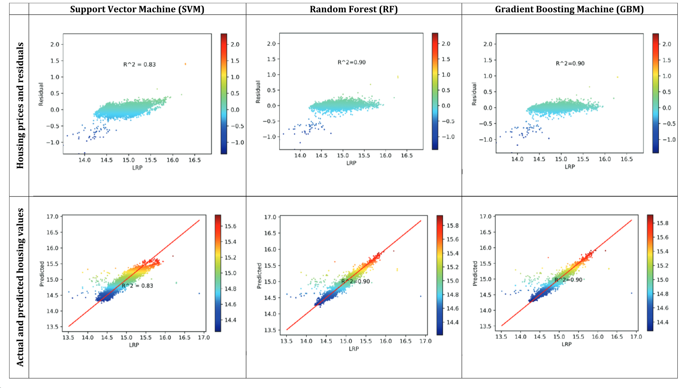

There are many previous attempts to predict property prices within a geographic region, in a generalised sense.

### The Classic Example - Boston House Prices

A staple amongst machine learning beginners, this dataset is used to teach machine learning techniques for regression problems.

There have been many prior attempts to create an optimised prediction model for this specific problem.

Examples:
* https://www.kaggle.com/code/mohaiminul101/boston-house-prices-linear-regression
* https://www.kaggle.com/datasets/fedesoriano/the-boston-houseprice-data

Techniques used to create prediction models include:
* Multiple linear regression
* XGBoost
* Decision Tree with Bagging (https://www.kaggle.com/code/pear2jam/bagging-hyperparameters/notebook)
### Kaggle

### Research Papers

https://www.tandfonline.com/doi/pdf/10.1080/09599916.2020.1832558?needAccess=true

Advocates for the usage of RF (random forest) and GBM (gradient boosting machines) in pursuit of an optimal property price prediction model, especially in preference to SVM (support vector machines).

### Towards Data Science

### University Research