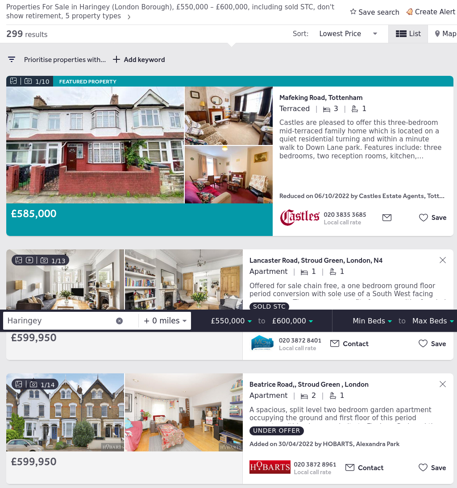
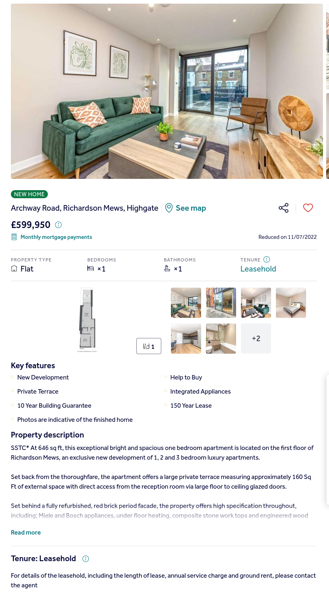

## Introduction
Data has been collected using website data from real estate websites.

## Overview of data collection

I used Scrapy to collect the property data.

### Breakdown of data collection

The data collected is broken into 4 categories:

#### Part 1. Data from the search results pages, which list all matching properties

Example: https://www.rightmove.co.uk/property-for-sale/find.html?locationIdentifier=REGION%5E61227&maxPrice=600000&minPrice=550000&sortType=1&index=216&propertyTypes=bungalow%2Cdetached%2Cflat%2Csemi-detached%2Cterraced&includeSSTC=true&mustHave=&dontShow=retirement&furnishTypes=&keywords=

---

#### Part 2. Data from the individual property pages

Example: https://www.rightmove.co.uk/properties/123478178#/?channel=RES_NEW

---
#### Part 3: Property data object used to serve the individual property webpage

Includes cleaner versions of much of the available feature data needed for Obtained from the underlying DOM object.

Example: [Link text](../../capstone_artifacts/json/05__01_model_data.json)

---

#### Part 4: Analytics metadata object used to represent auxiliary data

Obtained from the underlying DOM object.

Example: [Link text](../../capstone_artifacts/json/05__02_metadata.json)

---

## Collecting data

Data was collected from the website using Python and the Scrapy framework.

Data was collected into four overall datasets, corresponding to the four categories of data above.
The datasets are comma separated value (csv) files, which is a universal method for easily storing tabular data, which can also be easily used and manipulated by pandas package using Python. 

[Source Data](../../data/final_split)

## Joining data

The data is joined into a single dataset using pandas.

[Final Data](../../data/final/df_listings.csv)

## Exploratory Data Analysis

[Exploratory Data Analysis](../../process/C_insight/iteration01__001__basic_insights.ipynb)

## Cleaning and wrangling data collection

The data collected was frequently unclean and inconsistent.

## Problems encountered

### Initial problems

#### location.latitude not presented in number format

This was fixed by mutating the data type from object to float.

### Outliers

#### Properties with more than 10 bathrooms

It was possible to verify these as incorrect outliers by revisiting the source material, and the instances were discarded from the final dataset.

#### Properties with more than 5-10 bedrooms

By revisiting the source material, it was possible to verify that:
* more than 5 bedrooms in a property was possible (but expensive)
* more than 10 bedrooms in a property  se as incorrect outliers. The instances were discarded from the final dataset.

### Acquired subject matter expertise - Shared Ownership

Time spent with the data acquiring knowledge about the eunderlying featuresn and their impack revealed an interesting phenomenon - there was a category of properties which were systematically being underpredicted by the modelling.

This category of properties are known as SHARED OWNERSHIP properties.

#### Shared Ownership

Shared ownership allows a property to be sold for much less than its commercial price, and the purchaser will own the fraction of the property they have paid for. (The seller retains the remaining percentage, and charges the purchaser rent on the the remaining percentage).

The percentage being purchased was not collectable for the data in a systematic way, since the percentage was frequently not included, negotiable, or supplied in a non-conformant way which did not allow the data to be collected in an automated fashion. For this reasoning, I have decided to eliminate all instances of properties which have been identified as shared ownership, in order to allow better price prediction for the remaining properties. Later iterations of this project could include this feature if it would be beneficial. 

I identified three markers that a property is Shared Ownership:
* The boolean flag in the auxiliary json data is set to True:
* The website lists the property as Shared Ownership in the Key Features
* The website lists the property as Shared Ownership in the Description

I have included a step in the data cleaning to identify and remove these instances. Iteration 2 of the data accounts for this change.

### Later problems

* Property size is frequently unavailable
* Proximity to school information is not available in a way which can be easily obtained considering time constraints

### Additional problems:

* Property age is not available from source, other than knowledge about New Homes (age = 0).
  * 
  * Other methods to obtain information about property age were considered but ultimately discarded due to time constraints and discovery of other data which may prove sufficiently useful.

## Summary of remedies for unclean data

I have analysed the data to identify where it is incorrect or missing, and either:
* corrected the data
* imputed a value for that data
* where a suitable remedy could not be found, excluded that instance from the final version of the data