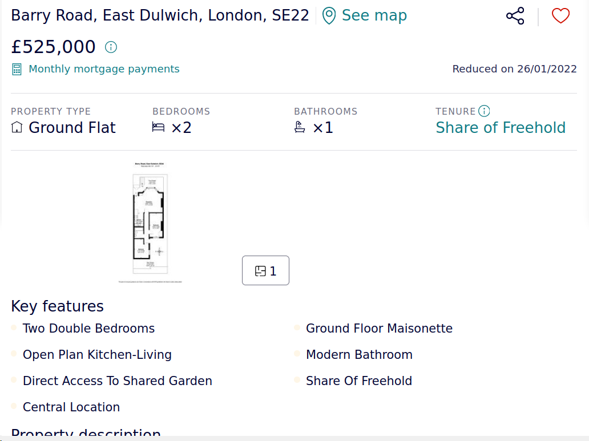

# Overview of investigated datasets

## Dataset Options

### Dataset 1: Prices paid as listed on Government website

Historical prices paid for houses, date of purchase, and other property related data are available on the government portal (https://www.gov.uk/government/statistical-data-sets/price-paid-data-downloads) 

#### Reference
stages/st_03.5/dataset_option1_prices_paid/pp-2017-part1.csv

### Dataset 2: Scraped data: Website scraping of estate agent websites. (Listing Pages only)

Estate agent websites are scraped to obtain asking prices (or accepted/sold prices, where applicable). 

Data which can be obtained from listing pages include:
* Approximate address
* Description of property and features
* Postcode (where available)
* Number of floorplans, images, and floorplans available 
* Price

### Dataset 3: Scraped data: Website scraping of estate agent websites. (Listing Pages and individual property pages)

Estate agent listing pages are scraped to obtain basic property information and gain references to individual property pages, and then the individual property pages are scraped to obtain more detailed information about the property

Data which can be obtained will be all listing pages data and also includes:
* Property type
* Number of bedrooms (where available)
* Number of bathrooms (where available)
* Key features available
* Proximity to underground train stations
* Proximity to mainline train stations

#### Reference
stages/st_03.5/dataset_option3_listing_property_scraped/sample_scraped_listing_property_data.csv

## Code for collecting data

Available within the repository (10_data_collection)

## Chosen Dataset

I have chosen to use option 3 (listing and individual property pages) with data enriching from other sources as part of an iterative agile discovery process.

I should be able to scrape 25000-40000 property samples over the course of the project.

## Sample of chosen Dataset

#### Reference
stages/st_03.5/dataset_option3_listing_property_scraped/sample_scraped_listing_property_data.csv