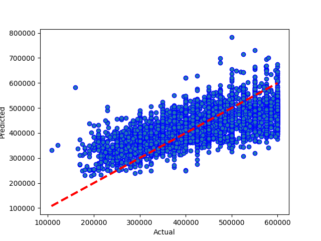
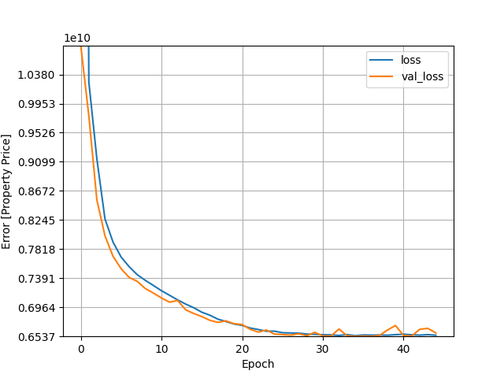

# Results from Neural Network m04 3 layers+wider
### Dataset Version: 06
Date run: 2022-12-04 06:38:01.815721

Start time: 2022-12-04 06:34:05.555608

End time: 2022-12-04 06:38:01.815712

## Results
### Summary
not updated saved model, the previous run was better
0.4452741740868206 is worse than or equal to '0.520933065817208

### Best Model: Comparing model predictions to actual property values

### Model Specific Notes
can't display hyperparameter comparison for neural network

can't display model performance graphs for neural network

can't display model performance graphs for neural network

### Neural Network Loss - Head
|    |        loss |    val_loss |   epoch |
|---:|------------:|------------:|--------:|
|  0 | 3.52719e+10 | 1.08068e+10 |       0 |
|  1 | 1.02713e+10 | 9.77362e+09 |       1 |
|  2 | 9.13833e+09 | 8.53694e+09 |       2 |
|  3 | 8.26167e+09 | 8.01364e+09 |       3 |
|  4 | 7.9204e+09  | 7.71204e+09 |       4 |

### Neural Network Loss - Tail
|    |        loss |    val_loss |   epoch |
|---:|------------:|------------:|--------:|
| 40 | 6.56955e+09 | 6.55057e+09 |      40 |
| 41 | 6.56153e+09 | 6.54241e+09 |      41 |
| 42 | 6.55614e+09 | 6.64157e+09 |      42 |
| 43 | 6.56341e+09 | 6.65581e+09 |      43 |
| 44 | 6.55509e+09 | 6.58961e+09 |      44 |

### Model Structure
>Model: "sequential"
>________________________________________________________________________________________________________________________________________________________________
> Layer (type)                                                           Output Shape                                                    Param #                 
>
> dense (Dense)                                                          (None, 11)                                                      132                     
>                                                                                                                                                                
> normalization (Normalization)                                          (None, 11)                                                      23                      
>                                                                                                                                                                
> dense_1 (Dense)                                                        (None, 30)                                                      360                     
>                                                                                                                                                                
> dense_2 (Dense)                                                        (None, 40)                                                      1240                    
>                                                                                                                                                                
> dense_3 (Dense)                                                        (None, 1)                                                       41                      
>                                                                                                                                                                
>
>Total params: 1,796
>Trainable params: 1,773
>Nontrainable params: 23
>________________________________________________________________________________________________________________________________________________________________

## Comparison with other models
### Comparison with version 06 performances
|                                         |   best score |    best time |   Mean Absolute Error Accuracy |   Mean Squared Error Accuracy |   R square Accuracy |   Root Mean Squared Error | best run date              | best method                                                                                                            |
|:----------------------------------------|-------------:|-------------:|-------------------------------:|------------------------------:|--------------------:|--------------------------:|:---------------------------|:-----------------------------------------------------------------------------------------------------------------------|
| random forest (v06)                     |     0.730879 |   31.8129    |                     41719      |                   3.0401e+09  |           0.730879  |                55137.1    | 2022-12-04 06:12:36.585726 | random search                                                                                                          |
| xg boost (tree) (v06)                   |     0.725989 |  217.286     |                     42057.3    |                   3.09534e+09 |           0.725989  |                55635.8    | 2022-12-03 00:21:25.790717 | random search                                                                                                          |
| knn (v06)                               |     0.719049 |    0.0179159 |                     41529.5    |                   3.21814e+09 |           0.715118  |                56728.7    | 2022-11-21 18:05:21.585382 | random search                                                                                                          |
| catboost (v06)                          |     0.715606 |   12.2565    |                     51000      |                   4.30136e+09 |           0.619227  |                65584.8    | 1999-11-13 15:26:55.706567 | random search                                                                                                          |
| light gradient boosting (v06)           |     0.706735 |   15.0439    |                     44276.9    |                   3.35667e+09 |           0.702855  |                57936.8    | 2022-11-16 13:59:52.612654 | random search                                                                                                          |
| xg boost (v06)                          |     0.687611 |   11.4748    |                     45988.3    |                   3.52887e+09 |           0.687611  |                59404.3    | nan                        | random search                                                                                                          |
| neural network m11 mega (v06)           |     0.612318 | 2569.45      |                        50.3061 |                4379.41        |           0.612318  |                   66.1771 | 2022-11-29 12:57:16.459719 | loss=2833.6 valloss=4034.41 stop=619/1000                                                                              |
| neural network m12 mega (v06)           |     0.594032 |  813.27      |                        53.2628 |                4585.98        |           0.594032  |                   67.7199 | 2022-11-29 17:08:44.480482 | loss=4386.51 valloss=4438.8 +valsplit=0.1 stop=201/400                                                                 |
| decision tree (v06)                     |     0.593752 |    1.0309    |                     53671.4    |                   4.58915e+09 |           0.593752  |                67743.2    | 2022-12-03 19:44:13.536639 | random search                                                                                                          |
| neural network m05 rec deep (v06)       |     0.580348 |  604.9       |                        55.3406 |                4917.4         |           0.564694  |                   70.1241 | 2022-11-29 11:41:39.682217 | loss=4908.71 valloss=4603.08 stop=214/500                                                                              |
| neural network (v06)                    |     0.556696 |  312.991     |                     66710.7    |                   6.64686e+09 |           0.411595  |                81528.3    | 2000-01-01 17:09:59.063570 | random search [input11, d^20-500-500-20-5, dense1]                                                                     |
| neural network m03 2 layers+wider (v06) |     0.549647 |  275.71      |                     85184.1    |                   1.02587e+10 |           0.0918594 |               101285      | 2022-11-29 10:13:10.517896 | mse +epochs=500 +learn=0.003 +loss=5229.0478515625                                                                     |
| neural network m01 simple (v06)         |     0.541221 |   36.2       |                     80597.6    |                   9.31393e+09 |           0.175496  |                96508.7    | 2022-11-29 09:13:15.856770 | recommended simple model/mse +norm +epochs=50 +learn=0.003 +endloss=5610.65771484375 +stop=17 +endloss=5511.7373046875 |
| neural network simplified (v06)         |     0.540642 |  999         |                     59373.1    |                   5.53151e+09 |           0.51033   |                74374.1    | 2022-11-20 20:03:40.645221 | recommended simple model + normalise, mse                                                                              |
| decision tree - (v06)                   |     0.524696 |  nan         |                     57094.1    |                   5.36923e+09 |           0.524696  |                73275      | nan                        | random search-no scale                                                                                                 |
| neural network m04 3 layers+wider (v06) |     0.520933 |  395.14      |                     64421.2    |                   6.26641e+09 |           0.445274  |                79160.6    | 2022-11-29 11:21:09.812732 | loss=5415.7 valloss=5095.94 stop=166/500                                                                               |
| neural network m02 two layers (v06)     |     0.516773 |  112.54      |                     64363.1    |                   6.26209e+09 |           0.445656  |                79133.4    | 2022-11-29 09:31:18.853517 | mse +norm +epochs=50 +learn=0.003 +endloss=5785.6953125                                                                |
| linear regression (ridge) (v06)         |     0.4569   |    0.28695   |                     63601.9    |                   6.13508e+09 |           0.4569    |                78326.7    | 2022-12-03 19:20:52.874336 | random search                                                                                                          |
### Comparison with all model performances
|                                                          |   best score |    best time |   Mean Absolute Error Accuracy |   Mean Squared Error Accuracy |   R square Accuracy |   Root Mean Squared Error | best run date              | best method                                                                                                            |
|:---------------------------------------------------------|-------------:|-------------:|-------------------------------:|------------------------------:|--------------------:|--------------------------:|:---------------------------|:-----------------------------------------------------------------------------------------------------------------------|
| random forest (v06)                                      |     0.730879 |   31.8129    |                     41719      |                   3.0401e+09  |           0.730879  |                55137.1    | 2022-12-04 06:12:36.585726 | random search                                                                                                          |
| xg boost (tree) (v06)                                    |     0.725989 |  217.286     |                     42057.3    |                   3.09534e+09 |           0.725989  |                55635.8    | 2022-12-03 00:21:25.790717 | random search                                                                                                          |
| xg boost (v11) rs                                        |     0.721019 |  nan         |                     42603      |                   3.15148e+09 |           0.721019  |                56138      | nan                        | nan                                                                                                                    |
| knn (v06)                                                |     0.719049 |    0.0179159 |                     41529.5    |                   3.21814e+09 |           0.715118  |                56728.7    | 2022-11-21 18:05:21.585382 | random search                                                                                                          |
| catboost (v06)                                           |     0.715606 |   12.2565    |                     51000      |                   4.30136e+09 |           0.619227  |                65584.8    | 1999-11-13 15:26:55.706567 | random search                                                                                                          |
| xg boost (v05) rs                                        |     0.710594 |  nan         |                     42229      |                   3.21963e+09 |           0.710594  |                56741.7    | nan                        | nan                                                                                                                    |
| light gradient boosting (v06)                            |     0.706735 |   15.0439    |                     44276.9    |                   3.35667e+09 |           0.702855  |                57936.8    | 2022-11-16 13:59:52.612654 | random search                                                                                                          |
| xg boost (v09)                                           |     0.701117 |  119.281     |                     51922.6    |                   4.35555e+09 |           0.614431  |                65996.6    | 2022-11-30 10:16:33.388760 | random search                                                                                                          |
| catboost (v09)                                           |     0.700506 |    2.82      |                     44531.4    |                   3.38321e+09 |           0.700506  |                58165.3    | 2022-11-30 13:34:39.793583 | random search(no dummies)                                                                                              |
| catboost (v10)                                           |     0.694651 |    4.77      |                     44875      |                   3.44935e+09 |           0.694651  |                58731.2    | 2022-11-30 14:14:50.145713 | random search(no dummies)                                                                                              |
| catboost (v11)                                           |     0.689818 |   12.81      |                     45407.3    |                   3.50394e+09 |           0.689818  |                59194.1    | 2022-11-30 16:14:29.405177 | random search(no dummies)                                                                                              |
| xg boost (v06)                                           |     0.687611 |   11.4748    |                     45988.3    |                   3.52887e+09 |           0.687611  |                59404.3    | nan                        | random search                                                                                                          |
| xg boost (v10)                                           |     0.681785 |    9.30959   |                     46626.7    |                   3.59469e+09 |           0.681785  |                59955.7    | 2022-11-30 14:45:52.207314 | random search                                                                                                          |
| random forest - random search (vx10)                     |     0.647421 |  nan         |                     49942      |                   3.98288e+09 |           0.647421  |                63110.1    | nan                        | nan                                                                                                                    |
| knn (v09)                                                |     0.644916 |    0.112408  |                     48389.1    |                   4.15737e+09 |           0.631974  |                64477.7    | 2022-11-30 12:53:42.390150 | random search                                                                                                          |
| neural network m11 mega (v06)                            |     0.612318 | 2569.45      |                        50.3061 |                4379.41        |           0.612318  |                   66.1771 | 2022-11-29 12:57:16.459719 | loss=2833.6 valloss=4034.41 stop=619/1000                                                                              |
| xg boost (tree) (v11)                                    |     0.603614 |   14.2104    |                     52330.4    |                   4.47774e+09 |           0.603614  |                66915.9    | 2022-11-30 20:18:59.876471 | random search                                                                                                          |
| xg boost (v04) rs                                        |     0.603522 |  nan         |                     50419.2    |                   4.50494e+09 |           0.603522  |                67118.9    | nan                        | nan                                                                                                                    |
| decision tree (v09)                                      |     0.596457 |    0.105919  |                     51852.7    |                   4.55859e+09 |           0.596457  |                67517.3    | 2022-11-29 20:03:38.094060 | random search                                                                                                          |
| neural network m12 mega (v06)                            |     0.594032 |  813.27      |                        53.2628 |                4585.98        |           0.594032  |                   67.7199 | 2022-11-29 17:08:44.480482 | loss=4386.51 valloss=4438.8 +valsplit=0.1 stop=201/400                                                                 |
| decision tree (v06)                                      |     0.593752 |    1.0309    |                     53671.4    |                   4.58915e+09 |           0.593752  |                67743.2    | 2022-12-03 19:44:13.536639 | random search                                                                                                          |
| neural network m13 mega (v10)                            |     0.583716 |  142.89      |                     54668.9    |                   4.94809e+09 |           0.561977  |                70342.6    | 2022-12-01 10:27:39.663081 | loss=3878948096.0 valloss=4822886400.0 +valsplit=0.1 stop=38/400                                                       |
| xg boost (v03) rs                                        |     0.582071 |  nan         |                     51147.3    |                   4.7333e+09  |           0.574533  |                68799      | nan                        | nan                                                                                                                    |
| neural network m05 rec deep (v06)                        |     0.580348 |  604.9       |                        55.3406 |                4917.4         |           0.564694  |                   70.1241 | 2022-11-29 11:41:39.682217 | loss=4908.71 valloss=4603.08 stop=214/500                                                                              |
| neural network m14 mega (v10)                            |     0.579095 | 1129.09      |                     53124      |                   4.75471e+09 |           0.579095  |                68954.4    | 2022-12-01 11:52:45.011704 | loss=4.85e+04 valloss=5.34e+04 +valsplit=0.1 stop=156/400                                                              |
| neural network m12 mega (v09)                            |     0.570335 |  556.62      |                        55.1583 |                4853.68        |           0.570335  |                   69.6683 | 2022-11-29 21:03:09.676165 | loss=4869.67 valloss=4726.34 +valsplit=0.1 stop=83/400                                                                 |
| neural network m12 mega (v10)                            |     0.567453 |  240.1       |                     55444      |                   4.88623e+06 |           0.567453  |                69901.6    | 2022-12-01 09:57:17.586487 | loss=4790.75 valloss=4998.79 +valsplit=0.1 stop=66/400                                                                 |
| decision tree - random search (vx10)                     |     0.558257 |  nan         |                     55865.4    |                   4.99011e+09 |           0.558257  |                70640.7    | nan                        | nan                                                                                                                    |
| neural network (v06)                                     |     0.556696 |  312.991     |                     66710.7    |                   6.64686e+09 |           0.411595  |                81528.3    | 2000-01-01 17:09:59.063570 | random search [input11, d^20-500-500-20-5, dense1]                                                                     |
| neural network m03 2 layers+wider (v06)                  |     0.549647 |  275.71      |                     85184.1    |                   1.02587e+10 |           0.0918594 |               101285      | 2022-11-29 10:13:10.517896 | mse +epochs=500 +learn=0.003 +loss=5229.0478515625                                                                     |
| neural network m01 simple (v06)                          |     0.541221 |   36.2       |                     80597.6    |                   9.31393e+09 |           0.175496  |                96508.7    | 2022-11-29 09:13:15.856770 | recommended simple model/mse +norm +epochs=50 +learn=0.003 +endloss=5610.65771484375 +stop=17 +endloss=5511.7373046875 |
| neural network m02 two layers (v09)                      |     0.540824 |  178.62      |                     57717.5    |                   5.18704e+06 |           0.540824  |                72021.1    | 2022-11-30 13:34:57.703544 | loss=5424.62 valloss=5263.41 +valsplit=0.1 stop=52/500                                                                 |
| neural network simplified (v06)                          |     0.540642 |  999         |                     59373.1    |                   5.53151e+09 |           0.51033   |                74374.1    | 2022-11-20 20:03:40.645221 | recommended simple model + normalise, mse                                                                              |
| knn - random search (vx10)                               |     0.533823 |    0.0497677 |                     57566.9    |                   5.26613e+09 |           0.533823  |                72568.1    | nan                        | nan                                                                                                                    |
| neural network - random search [i64,norm,d64^6,d1] (v11) |     0.533579 |  nan         |                     57201.7    |                   5.26888e+09 |           0.533579  |                72587      | nan                        | nan                                                                                                                    |
| decision tree - (v06)                                    |     0.524696 |  nan         |                     57094.1    |                   5.36923e+09 |           0.524696  |                73275      | nan                        | random search-no scale                                                                                                 |
| neural network m04 3 layers+wider (v06)                  |     0.520933 |  395.14      |                     64421.2    |                   6.26641e+09 |           0.445274  |                79160.6    | 2022-11-29 11:21:09.812732 | loss=5415.7 valloss=5095.94 stop=166/500                                                                               |
| neural network m02 two layers (v06)                      |     0.516773 |  112.54      |                     64363.1    |                   6.26209e+09 |           0.445656  |                79133.4    | 2022-11-29 09:31:18.853517 | mse +norm +epochs=50 +learn=0.003 +endloss=5785.6953125                                                                |
| neural network m01 simple (v09)                          |     0.508847 |  188.63      |                     60215.3    |                   5.54826e+06 |           0.508847  |                74486.6    | 2022-11-30 13:08:10.248178 | loss=5724.92 valloss=5608.12 +valsplit=0.1 stop=42/50                                                                  |
| knn (v10)                                                |     0.484585 |    0.29179   |                     61764.2    |                   5.82234e+09 |           0.484585  |                76304.2    | 2022-11-30 15:12:50.989371 | random search                                                                                                          |
| xg boost (v11)                                           |     0.484341 |    1.66323   |                     61556.7    |                   5.82509e+09 |           0.484341  |                76322.3    | 2022-11-30 16:55:55.436173 | random search                                                                                                          |
| xg boost (linear) (v11)                                  |     0.484341 |   12.6817    |                     62224.3    |                   5.90103e+09 |           0.477618  |                76818.2    | 2022-11-30 19:47:04.498556 | random search                                                                                                          |
| linear regression (ridge) (v10)                          |     0.470806 |    0.239057  |                     62597.3    |                   5.97826e+09 |           0.470782  |                77319.2    | 2022-12-01 19:50:08.050622 | random search                                                                                                          |
| knn (v11)                                                |     0.465113 |    0.618877  |                     62944.7    |                   6.0423e+09  |           0.465113  |                77732.2    | 2022-11-30 16:20:53.948815 | random search                                                                                                          |
| linear regression (ridge) (v09)                          |     0.459888 |    0.252632  |                     63349.5    |                   6.10132e+09 |           0.459888  |                78110.9    | 2022-11-29 19:51:49.096191 | random search                                                                                                          |
| linear regression (ridge) (v06)                          |     0.4569   |    0.28695   |                     63601.9    |                   6.13508e+09 |           0.4569    |                78326.7    | 2022-12-03 19:20:52.874336 | random search                                                                                                          |
| random forest (v09)                                      |     0.254902 |    4.46726   |                     75769.6    |                   8.41693e+09 |           0.254902  |                91743.9    | 2022-11-29 20:45:43.360554 | random search                                                                                                          |
| decision tree - random search (v02)                      |   nan        |  nan         |                     74555      |                   8.26982e+09 |           0.27729   |                90938.6    | nan                        | nan                                                                                                                    |
| knn - basic (v01)                                        |   nan        |  nan         |                     55623.7    |                   5.34585e+09 |           0.546891  |                73115.3    | nan                        | nan                                                                                                                    |
| knn - basic (v02)                                        |   nan        |  nan         |                     52181.5    |                   4.75613e+09 |           0.584356  |                68964.7    | nan                        | nan                                                                                                                    |
| knn - random search (v01)                                |   nan        |  nan         |                     52593.9    |                   4.86155e+09 |           0.587939  |                69724.8    | nan                        | nan                                                                                                                    |
| knn - random search (v02)                                |   nan        |  nan         |                     49441.2    |                   4.26278e+09 |           0.62747   |                65290      | nan                        | nan                                                                                                                    |
| knn - scaled (v01)                                       |   nan        |  nan         |                     52147.4    |                   4.86744e+09 |           0.58744   |                69767.1    | nan                        | nan                                                                                                                    |
| linear regression (ridge) - random search (v02)          |   nan        |  nan         |                     71267.9    |                   7.70239e+09 |           0.326879  |                87763.2    | nan                        | nan                                                                                                                    |
| linear regression (ridge) - random search (v03)          |   nan        |  nan         |                     70746.7    |                   7.49253e+09 |           0.326511  |                86559.4    | nan                        | nan                                                                                                                    |
| linear regression (ridge) - random search (v04)          |   nan        |  nan         |                     71834.4    |                   7.71252e+09 |           0.321224  |                87821      | nan                        | nan                                                                                                                    |
| linear regression (ridge) - random search (v05)          |   nan        |  nan         |                     63770.7    |                   6.19128e+09 |           0.443478  |                78684.7    | nan                        | nan                                                                                                                    |
| linear regression - basic (v01)                          |   nan        |  nan         |                     72921.6    |                   8.29799e+09 |           0.29667   |                91093.3    | nan                        | nan                                                                                                                    |
| xg boost (v02) rs                                        |   nan        |  nan         |                     45160.2    |                   3.62788e+09 |           0.682955  |                60231.8    | nan                        | nan                                                                                                                    |
| xg boost - basic (v02)                                   |   nan        |  nan         |                     48536.5    |                   3.97959e+09 |           0.652219  |                63084      | nan                        | nan                                                                                                                    |
## Appendix
### Data Sample
|          |   Price |   bedrooms |   bathrooms |   nearestStation |   location.latitude |   location.longitude |   latitude_deviation |   longitude_deviation | tenure.tenureType   |
|---------:|--------:|-----------:|------------:|-----------------:|--------------------:|---------------------:|---------------------:|----------------------:|:--------------------|
| 14520525 |  550000 |          3 |           1 |         0.274316 |             51.5299 |            -0.20702  |             0.03023  |              0.1026   | LEASEHOLD           |
| 27953107 |  400000 |          2 |           2 |         0.305845 |             51.5494 |            -0.4826   |             0.04967  |              0.37818  | LEASEHOLD           |
| 33593487 |  579950 |          2 |           1 |         0.438045 |             51.4472 |            -0.33877  |             0.05254  |              0.23435  | FREEHOLD            |
| 35271294 |  370000 |          2 |           1 |         0.399307 |             51.4496 |            -0.140154 |             0.050152 |              0.035734 | LEASEHOLD           |
| 44749111 |  475000 |          2 |           1 |         0.41055  |             51.37   |            -0.21241  |             0.12967  |              0.10799  | FREEHOLD            |
### FIX THIS!!
FIX THIS!

### Environment Variables
notebook_environment = gradient

use_gpu = True

debug_mode = False

quick_mode = False

quick_override_cv_splits = 2

quick_override_n_iter = 10

quick_override_n_jobs = 3

### Useful info
Tensorflow version: 2.9.1

