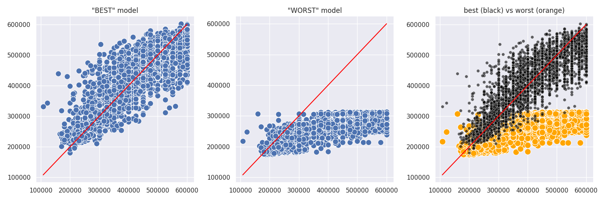
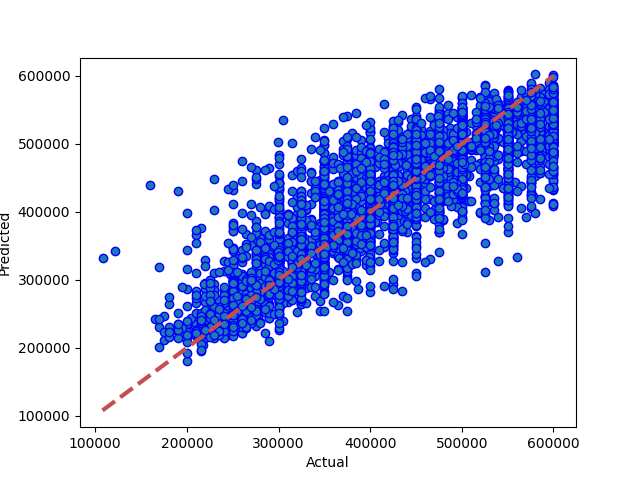
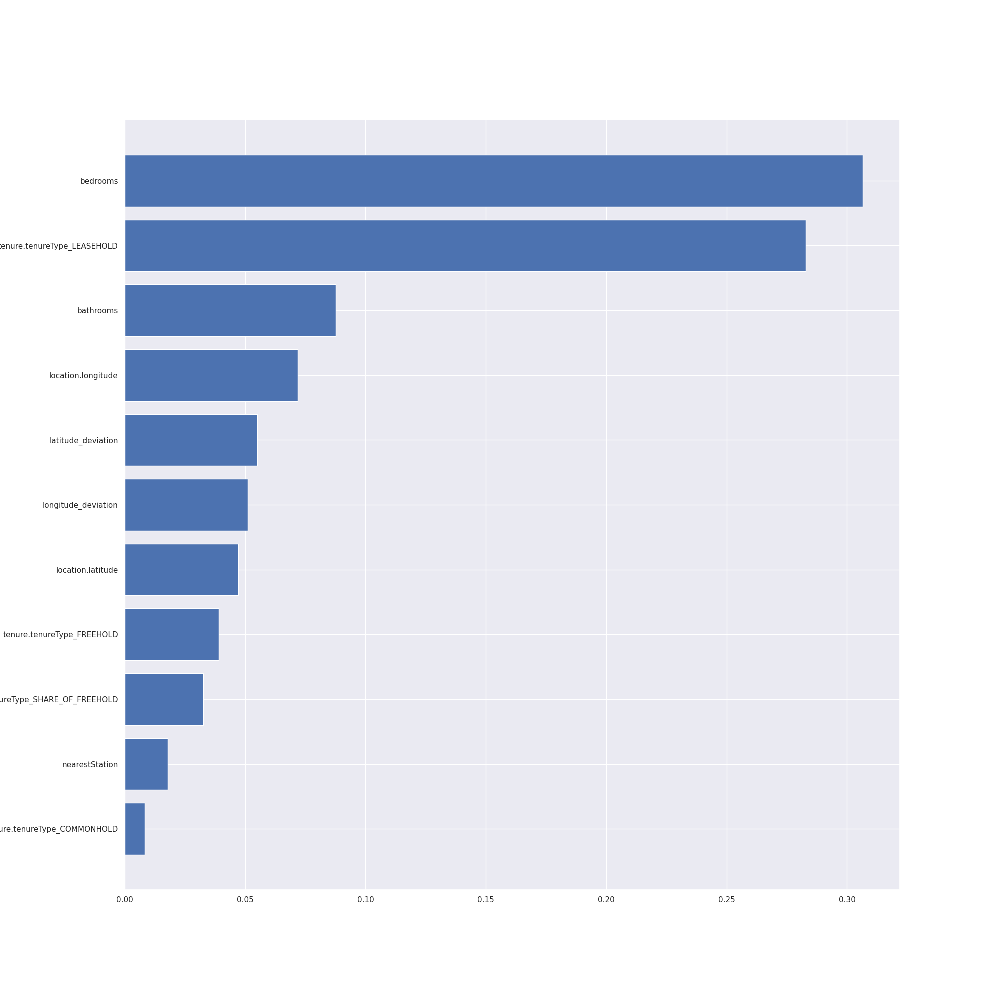
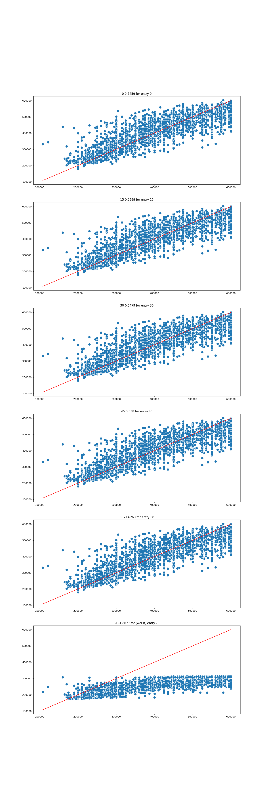

# Results from XG Boost (tree)
### Dataset Version: 06
Date run: 2023-01-01 20:12:33.820207

Start time: 2023-01-01 17:55:58.232290

End time: 2023-01-01 20:12:33.820207

## Results
### Summary
not updated saved model, the previous run was better
0.7259292050108297 is worse than or equal to 0.7271319570762387

### Tuned Models ranked by performance, with parameter details
|   rank_test_score |   mean_test_score |   mean_fit_time |   mean_score_time |   param_model__verbosity | param_model__tree_method   |   param_model__subsample | param_model__objective   |   param_model__n_jobs |   param_model__n_estimators |   param_model__min_samples_leaf |   param_model__min_sample_split |   param_model__max_samples |   param_model__max_leaf_nodes |   param_model__max_features |   param_model__max_depth |   param_model__learning_rate |   param_model__lambda |   param_model__colsample_bytree | param_model__booster   | params2                                                                     |
|------------------:|------------------:|----------------:|------------------:|-------------------------:|:---------------------------|-------------------------:|:-------------------------|----------------------:|----------------------------:|--------------------------------:|--------------------------------:|---------------------------:|------------------------------:|----------------------------:|-------------------------:|-----------------------------:|----------------------:|--------------------------------:|:-----------------------|:----------------------------------------------------------------------------|
|                 1 |          0.711671 |         40.6133 |          0.482817 |                        1 | hist                       |                     0.9  | reg:squarederror         |                     3 |                         200 |                              20 |                             200 |                       0.75 |                             2 |                          16 |                       10 |                          0.1 |                    10 |                            0.75 | dart                   | 1/hist/0.9/reg:squarederror/3/200/20/200/0.75/2/16/10/0.1/10/0.75/dart      |
|                 2 |          0.710497 |         28.2861 |          0.317234 |                        1 | auto                       |                     0.5  | reg:squarederror         |                     3 |                         500 |                                 |                             200 |                       0.75 |                             2 |                             |                       10 |                          0.1 |                    10 |                            0.9  | gbtree                 | 1/auto/0.5/reg:squarederror/3/500/None/200/0.75/2/None/10/0.1/10/0.9/gbtree |
|                 3 |          0.704936 |         13.9615 |          0.13509  |                        1 | auto                       |                     0.75 | reg:squarederror         |                     3 |                         200 |                              20 |                                 |                       1    |                            20 |                             |                       10 |                          0.1 |                     1 |                            1    | gbtree                 | 1/auto/0.75/reg:squarederror/3/200/20/None/1/20/None/10/0.1/1/1/gbtree      |
|                 4 |          0.702083 |         40.5878 |          0.644837 |                        1 | hist                       |                     0.9  | reg:squarederror         |                     3 |                         200 |                             200 |                               2 |                       1    |                               |                             |                       10 |                          0.3 |                   100 |                            0.5  | dart                   | 1/hist/0.9/reg:squarederror/3/200/200/2/1/None/None/10/0.3/100/0.5/dart     |
|                 5 |          0.70022  |        179.528  |          2.09551  |                        1 | hist                       |                     0.75 | reg:squarederror         |                     3 |                         500 |                             200 |                             200 |                            |                            20 |                          64 |                        6 |                          0.1 |                       |                            0.9  | dart                   | 1/hist/0.75/reg:squarederror/3/500/200/200/None/20/64/6/0.1/None/0.9/dart   |
|                 6 |          0.697781 |        209.61   |          1.88128  |                        1 | hist                       |                     0.5  | reg:squarederror         |                     3 |                         500 |                             200 |                               2 |                            |                          2000 |                             |                        8 |                              |                   100 |                            0.9  | dart                   | 1/hist/0.5/reg:squarederror/3/500/200/2/None/2000/None/8/None/100/0.9/dart  |
|                 7 |          0.696881 |         24.9677 |          0.212928 |                        1 | auto                       |                     1    | reg:squarederror         |                     3 |                         500 |                                 |                              20 |                       0.9  |                            20 |                          16 |                        8 |                              |                   100 |                            0.9  | gbtree                 | 1/auto/1/reg:squarederror/3/500/None/20/0.9/20/16/8/None/100/0.9/gbtree     |
### Best and worst models obtained by tuning

### Best Model: Comparing model predictions to actual property values

## Feature Importances
### Feature Importances
1. features 0 (0.306585)		bedrooms
2. features 9 (0.282816)		tenure.tenureType_LEASEHOLD
3. features 1 (0.087689)		bathrooms
4. features 4 (0.071798)		location.longitude
5. features 5 (0.055025)		latitude_deviation
6. features 6 (0.051183)		longitude_deviation
7. features 3 (0.047226)		location.latitude
8. features 8 (0.038999)		tenure.tenureType_FREEHOLD
9. features 10 (0.032628)		tenure.tenureType_SHARE_OF_FREEHOLD
10. features 2 (0.017775)		nearestStation
11. features 7 (0.008275)		tenure.tenureType_COMMONHOLD

### Feature Importances (XG Boost (tree))

## Comparison with other models
### Comparison with version 06 performances
|                                         |   best score |    best time |   Mean Absolute Error Accuracy |   Mean Squared Error Accuracy |   R square Accuracy |   Root Mean Squared Error | best run date              | best method                                                                                                            |
|:----------------------------------------|-------------:|-------------:|-------------------------------:|------------------------------:|--------------------:|--------------------------:|:---------------------------|:-----------------------------------------------------------------------------------------------------------------------|
| xg boost (tree) (v06)                   |     0.727132 |  134.175     |                        42215   |                   3.09601e+09 |            0.725929 |                   55641.8 | 2022-12-07 09:43:37.103009 | random search                                                                                                          |
| knn (v06)                               |     0.719049 |    0.0179159 |                        41531.1 |                   3.2181e+09  |            0.715122 |                   56728.3 | 2022-11-21 18:05:21.585382 | random search                                                                                                          |
| catboost (v06)                          |     0.715606 |   12.2565    |                        51000   |                   4.30136e+09 |            0.619227 |                   65584.8 | 1999-11-13 15:26:55.706567 | random search                                                                                                          |
| light gradient boosting (v06)           |     0.706735 |   15.0439    |                        44081   |                   3.31284e+09 |            0.706735 |                   57557.3 | 2022-11-16 13:59:52.612654 | random search                                                                                                          |
| xg boost (v06)                          |     0.687611 |   11.4748    |                        45988.3 |                   3.52887e+09 |            0.687611 |                   59404.3 | nan                        | random search                                                                                                          |
| decision tree (v06)                     |     0.616727 |    0.133738  |                        59431.1 |                   5.74359e+09 |            0.491556 |                   75786.5 | 2022-12-11 13:59:57.993851 | random search                                                                                                          |
| neural network m11 mega (v06)           |     0.612318 | 2569.45      |                        56035.9 |                   4.92994e+09 |            0.563583 |                   70213.6 | 2022-11-29 12:57:16.459719 | loss=2833.6 valloss=4034.41 stop=619/1000                                                                              |
| neural network m12 mega (v06)           |     0.594032 |  813.27      |                        54968   |                   4.80703e+09 |            0.574463 |                   69332.8 | 2022-11-29 17:08:44.480482 | loss=4386.51 valloss=4438.8 +valsplit=0.1 stop=201/400                                                                 |
| random forest (v06)                     |     0.585876 |    1.76986   |                        60537   |                   5.63491e+09 |            0.501177 |                   75066   | 2022-12-11 12:04:23.528125 | random search                                                                                                          |
| neural network m05 rec deep (v06)       |     0.580348 |  604.9       |                        59357.5 |                   5.47083e+09 |            0.515701 |                   73965.1 | 2022-11-29 11:41:39.682217 | loss=4908.71 valloss=4603.08 stop=214/500                                                                              |
| neural network (v06)                    |     0.556696 |  312.991     |                        66710.7 |                   6.64686e+09 |            0.411595 |                   81528.3 | 2000-01-01 17:09:59.063570 | random search [input11, d^20-500-500-20-5, dense1]                                                                     |
| neural network m03 2 layers+wider (v06) |     0.549647 |  275.71      |                        64376.5 |                   6.26802e+09 |            0.445131 |                   79170.9 | 2022-11-29 10:13:10.517896 | mse +epochs=500 +learn=0.003 +loss=5229.0478515625                                                                     |
| neural network m01 simple (v06)         |     0.541221 |   36.2       |                        69132   |                   7.15587e+09 |            0.366536 |                   84592.4 | 2022-11-29 09:13:15.856770 | recommended simple model/mse +norm +epochs=50 +learn=0.003 +endloss=5610.65771484375 +stop=17 +endloss=5511.7373046875 |
| neural network simplified (v06)         |     0.540642 |  999         |                        59373.1 |                   5.53151e+09 |            0.51033  |                   74374.1 | 2022-11-20 20:03:40.645221 | recommended simple model + normalise, mse                                                                              |
| neural network m04 3 layers+wider (v06) |     0.520933 |  395.14      |                        64421.2 |                   6.26641e+09 |            0.445274 |                   79160.6 | 2022-11-29 11:21:09.812732 | loss=5415.7 valloss=5095.94 stop=166/500                                                                               |
| neural network m02 two layers (v06)     |     0.516773 |  112.54      |                        64363.1 |                   6.26209e+09 |            0.445656 |                   79133.4 | 2022-11-29 09:31:18.853517 | mse +norm +epochs=50 +learn=0.003 +endloss=5785.6953125                                                                |
| linear regression (ridge) (v06)         |     0.4569   |    0.28695   |                        63603.1 |                   6.13521e+09 |            0.456889 |                   78327.6 | 2022-12-03 19:20:52.874336 | random search                                                                                                          |
### Comparison with all model performances
|                                                           |   best score |    best time |   Mean Absolute Error Accuracy |   Mean Squared Error Accuracy |   R square Accuracy |   Root Mean Squared Error | best run date              | best method                                                                                                            |
|:----------------------------------------------------------|-------------:|-------------:|-------------------------------:|------------------------------:|--------------------:|--------------------------:|:---------------------------|:-----------------------------------------------------------------------------------------------------------------------|
| xg boost (tree) (v06)                                     |     0.727132 |  134.175     |                42215           |                   3.09601e+09 |            0.725929 |           55641.8         | 2022-12-07 09:43:37.103009 | random search                                                                                                          |
| xg boost (tree) (v09)                                     |     0.721352 |  179.821     |                42675.7         |                   3.14772e+09 |            0.721352 |           56104.5         | 2022-12-14 00:46:51.090690 | random search                                                                                                          |
| xg boost (v11) rs                                         |     0.721019 |  nan         |                42603           |                   3.15148e+09 |            0.721019 |           56138           | nan                        | nan                                                                                                                    |
| knn (v06)                                                 |     0.719049 |    0.0179159 |                41531.1         |                   3.2181e+09  |            0.715122 |           56728.3         | 2022-11-21 18:05:21.585382 | random search                                                                                                          |
| catboost (v06)                                            |     0.715606 |   12.2565    |                51000           |                   4.30136e+09 |            0.619227 |           65584.8         | 1999-11-13 15:26:55.706567 | random search                                                                                                          |
| xg boost (v05) rs                                         |     0.710594 |  nan         |                42229           |                   3.21963e+09 |            0.710594 |           56741.7         | nan                        | nan                                                                                                                    |
| light gradient boosting (v06)                             |     0.706735 |   15.0439    |                44081           |                   3.31284e+09 |            0.706735 |           57557.3         | 2022-11-16 13:59:52.612654 | random search                                                                                                          |
| xg boost (v09)                                            |     0.701117 |  119.281     |                51922.6         |                   4.35555e+09 |            0.614431 |           65996.6         | 2022-11-30 10:16:33.388760 | random search                                                                                                          |
| catboost (v09)                                            |     0.700506 |    2.82      |                74210.9         |                   8.5691e+09  |            0.241431 |           92569.4         | 2022-11-30 13:34:39.793583 | random search(no dummies)                                                                                              |
| catboost (v10)                                            |     0.694651 |    4.77      |                44875           |                   3.44935e+09 |            0.694651 |           58731.2         | 2022-11-30 14:14:50.145713 | random search(no dummies)                                                                                              |
| catboost (v11)                                            |     0.689818 |   12.81      |                70705.7         |                   7.67228e+09 |            0.320821 |           87591.5         | 2022-11-30 16:14:29.405177 | random search(no dummies)                                                                                              |
| xg boost (v06)                                            |     0.687611 |   11.4748    |                45988.3         |                   3.52887e+09 |            0.687611 |           59404.3         | nan                        | random search                                                                                                          |
| xg boost (v10)                                            |     0.681785 |    9.30959   |                46626.7         |                   3.59469e+09 |            0.681785 |           59955.7         | 2022-11-30 14:45:52.207314 | random search                                                                                                          |
| random forest (v09)                                       |     0.680091 | 1127.32      |                46294.6         |                   3.61382e+09 |            0.680091 |           60115           | 2022-12-11 19:26:14.332459 | random search                                                                                                          |
| random forest - random search (vx10)                      |     0.647421 |  nan         |                49942           |                   3.98288e+09 |            0.647421 |           63110.1         | nan                        | nan                                                                                                                    |
| knn (v09)                                                 |     0.644916 |    0.112408  |                48389.1         |                   4.15737e+09 |            0.631974 |           64477.7         | 2022-11-30 12:53:42.390150 | random search                                                                                                          |
| neural network m15 mega + dropout (v09)                   |     0.622235 | 2077.84      |                    2.12535e+11 |                   4.79951e+22 |          -15.9948   |               2.19078e+11 | 2022-12-13 23:57:56.104125 | loss=4.38e+04 valloss=4.85e+04 +valsplit=0.1 +patn=25 stop=306/400                                                     |
| decision tree (v09)                                       |     0.619635 |    0.409451  |                51319.1         |                   4.31524e+09 |            0.617999 |           65690.5         | 2022-12-11 14:59:07.675693 | random search                                                                                                          |
| decision tree (v06)                                       |     0.616727 |    0.133738  |                59431.1         |                   5.74359e+09 |            0.491556 |           75786.5         | 2022-12-11 13:59:57.993851 | random search                                                                                                          |
| neural network m11 mega (v06)                             |     0.612318 | 2569.45      |                56035.9         |                   4.92994e+09 |            0.563583 |           70213.6         | 2022-11-29 12:57:16.459719 | loss=2833.6 valloss=4034.41 stop=619/1000                                                                              |
| neural network m14 mega (v09)                             |     0.610895 | 2179.86      |                51080.5         |                   4.39548e+09 |            0.610895 |           66298.4         | 2022-12-12 16:01:42.195065 | loss=4.68e+04 valloss=5.01e+04 +valsplit=0.1 +patn=25 stop=230/400                                                     |
| neural network m13 mega (v09)                             |     0.607154 |  500.16      |                50938.6         |                   4.43775e+09 |            0.607154 |           66616.4         | 2022-12-12 15:25:17.070719 | loss=4.55e+04 valloss=5.03e+04 +valsplit=0.1 +patn=25 stop=104/400                                                     |
| xg boost (tree) (v11)                                     |     0.603614 |   14.2104    |                52330.4         |                   4.47774e+09 |            0.603614 |           66915.9         | 2022-11-30 20:18:59.876471 | random search                                                                                                          |
| xg boost (v04) rs                                         |     0.603522 |  nan         |                50419.2         |                   4.50494e+09 |            0.603522 |           67118.9         | nan                        | nan                                                                                                                    |
| neural network m12 mega (v06)                             |     0.594032 |  813.27      |                54968           |                   4.80703e+09 |            0.574463 |           69332.8         | 2022-11-29 17:08:44.480482 | loss=4386.51 valloss=4438.8 +valsplit=0.1 stop=201/400                                                                 |
| neural network m11 mega (v09)                             |     0.587136 |  994.87      |                53873           |                   4.66388e+09 |            0.587136 |           68292.6         | 2022-12-12 15:02:24.649254 | loss=4.26e+09 valloss=4.72e+09 +valsplit=0.1 +patn=25 stop=189/400                                                     |
| random forest (v06)                                       |     0.585876 |    1.76986   |                60537           |                   5.63491e+09 |            0.501177 |           75066           | 2022-12-11 12:04:23.528125 | random search                                                                                                          |
| neural network m13 mega (v10)                             |     0.583716 |  142.89      |                54668.9         |                   4.94809e+09 |            0.561977 |           70342.6         | 2022-12-01 10:27:39.663081 | loss=3878948096.0 valloss=4822886400.0 +valsplit=0.1 stop=38/400                                                       |
| xg boost (v03) rs                                         |     0.582071 |  nan         |                51147.3         |                   4.7333e+09  |            0.574533 |           68799           | nan                        | nan                                                                                                                    |
| neural network m05 rec deep (v06)                         |     0.580348 |  604.9       |                59357.5         |                   5.47083e+09 |            0.515701 |           73965.1         | 2022-11-29 11:41:39.682217 | loss=4908.71 valloss=4603.08 stop=214/500                                                                              |
| neural network m14 mega (v10)                             |     0.579095 | 1129.09      |                53124           |                   4.75471e+09 |            0.579095 |           68954.4         | 2022-12-01 11:52:45.011704 | loss=4.85e+04 valloss=5.34e+04 +valsplit=0.1 stop=156/400                                                              |
| neural network m12 mega (v09)                             |     0.571972 |  848.7       |                54696           |                   4.83518e+09 |            0.571972 |           69535.4         | 2022-12-12 15:16:52.189760 | loss=4.76e+09 valloss=4.77e+09 +valsplit=0.1 +patn=25 stop=179/400                                                     |
| neural network m15 mega + dropout (v11)                   |     0.5707   | 1191.61      |                53709.7         |                   4.84954e+09 |            0.5707   |           69638.7         | 2022-12-21 02:55:33.483148 | loss=4.43e+04 valloss=5.35e+04 +valsplit=0.1 +patn=25 stop=170/400                                                     |
| neural network m12 mega (v10)                             |     0.567453 |  240.1       |                55444           |                   4.88623e+06 |            0.567453 |           69901.6         | 2022-12-01 09:57:17.586487 | loss=4790.75 valloss=4998.79 +valsplit=0.1 stop=66/400                                                                 |
| neural network m05 rec deep (v09)                         |     0.558413 | 1471.09      |                56357.5         |                   5.01567e+09 |            0.555995 |           70821.4         | 2022-12-12 13:21:58.501853 | loss=4.87e+09 valloss=4.84e+09 +valsplit=0.1 +patn=25                                                                  |
| decision tree - random search (vx10)                      |     0.558257 |  nan         |                55865.4         |                   4.99011e+09 |            0.558257 |           70640.7         | nan                        | nan                                                                                                                    |
| neural network (v06)                                      |     0.556696 |  312.991     |                66710.7         |                   6.64686e+09 |            0.411595 |           81528.3         | 2000-01-01 17:09:59.063570 | random search [input11, d^20-500-500-20-5, dense1]                                                                     |
| neural network m03 2 layers+wider (v06)                   |     0.549647 |  275.71      |                64376.5         |                   6.26802e+09 |            0.445131 |           79170.9         | 2022-11-29 10:13:10.517896 | mse +epochs=500 +learn=0.003 +loss=5229.0478515625                                                                     |
| neural network m01 simple (v06)                           |     0.541221 |   36.2       |                69132           |                   7.15587e+09 |            0.366536 |           84592.4         | 2022-11-29 09:13:15.856770 | recommended simple model/mse +norm +epochs=50 +learn=0.003 +endloss=5610.65771484375 +stop=17 +endloss=5511.7373046875 |
| neural network m02 two layers (v09)                       |     0.540824 |  178.62      |                59659.9         |                   5.50478e+09 |            0.512696 |           74194.2         | 2022-11-30 13:34:57.703544 | loss=5424.62 valloss=5263.41 +valsplit=0.1 stop=52/500                                                                 |
| neural network m04 3 layers+wider (v09)                   |     0.540678 | 1367.3       |                60774.6         |                   5.6628e+09  |            0.498708 |           75251.6         | 2022-12-12 11:55:30.653553 | loss=5.20e+09 valloss=5.09e+09 +valsplit=0.1 +patn=25                                                                  |
| neural network simplified (v06)                           |     0.540642 |  999         |                59373.1         |                   5.53151e+09 |            0.51033  |           74374.1         | 2022-11-20 20:03:40.645221 | recommended simple model + normalise, mse                                                                              |
| knn - random search (vx10)                                |     0.533823 |    0.0497677 |                57566.9         |                   5.26613e+09 |            0.533823 |           72568.1         | nan                        | nan                                                                                                                    |
| neural network - random search [i64,norm,d64^6,d1] (v11)  |     0.533579 |  nan         |                57201.7         |                   5.26888e+09 |            0.533579 |           72587           | nan                        | nan                                                                                                                    |
| neural network m04 3 layers+wider (v06)                   |     0.520933 |  395.14      |                64421.2         |                   6.26641e+09 |            0.445274 |           79160.6         | 2022-11-29 11:21:09.812732 | loss=5415.7 valloss=5095.94 stop=166/500                                                                               |
| neural network m02 two layers (v06)                       |     0.516773 |  112.54      |                64363.1         |                   6.26209e+09 |            0.445656 |           79133.4         | 2022-11-29 09:31:18.853517 | mse +norm +epochs=50 +learn=0.003 +endloss=5785.6953125                                                                |
| neural network m01 simple (v09)                           |     0.508847 |  188.63      |                71376.9         |                   7.55056e+09 |            0.331597 |           86893.9         | 2022-11-30 13:08:10.248178 | loss=5724.92 valloss=5608.12 +valsplit=0.1 stop=42/50                                                                  |
| neural network with autoencoding m15 mega + dropout (v11) |     0.488747 | 1276.23      |                58773.7         |                   5.77532e+09 |            0.488747 |           75995.5         | 2022-12-22 19:06:48.049482 | loss=5.27e+04 valloss=5.91e+04 +valsplit=0.1 +patn=25 stop=181/400                                                     |
| knn (v10)                                                 |     0.484585 |    0.29179   |                61764.2         |                   5.82234e+09 |            0.484585 |           76304.2         | 2022-11-30 15:12:50.989371 | random search                                                                                                          |
| xg boost (v11)                                            |     0.484341 |    1.66323   |                61556.7         |                   5.82509e+09 |            0.484341 |           76322.3         | 2022-11-30 16:55:55.436173 | random search                                                                                                          |
| xg boost (linear) (v11)                                   |     0.484341 |   12.6817    |                62224.3         |                   5.90103e+09 |            0.477618 |           76818.2         | 2022-11-30 19:47:04.498556 | random search                                                                                                          |
| linear regression (ridge) (v11)                           |     0.484311 |    0.2412    |                61567.5         |                   5.82554e+09 |            0.484302 |           76325.2         | 2023-01-01 10:07:22.564855 | random search(pca,1.0% retain)                                                                                         |
| linear regression (ridge) (v10)                           |     0.470806 |    0.239057  |                62604.9         |                   5.97844e+09 |            0.470766 |           77320.4         | 2022-12-01 19:50:08.050622 | random search                                                                                                          |
| knn (v11)                                                 |     0.465113 |    0.618877  |                62944.7         |                   6.0423e+09  |            0.465113 |           77732.2         | 2022-11-30 16:20:53.948815 | random search                                                                                                          |
| linear regression (ridge) (v09)                           |     0.459955 |    0.100284  |                75320.7         |                   8.37687e+09 |            0.258448 |           91525.3         | 2023-01-01 09:49:20.349186 | random search(pca)                                                                                                     |
| linear regression (ridge) (v06)                           |     0.4569   |    0.28695   |                63603.1         |                   6.13521e+09 |            0.456889 |           78327.6         | 2022-12-03 19:20:52.874336 | random search                                                                                                          |
| neural network m03 2 layers+wider (v09)                   |     0.4523   | 1822.49      |                64123.6         |                   6.24293e+09 |            0.447352 |           79012.2         | 2022-12-11 18:56:27.304803 | loss=6.38e+09 valloss=6.41e+09 +valsplit=0.1 +patn=25                                                                  |
| neural network with autoencoding m15 mega + dropout (v09) |     0.42689  | 1641.39      |                64379.5         |                   6.47409e+09 |            0.42689  |           80461.7         | 2022-12-21 01:26:33.005210 | loss=6.51e+04 valloss=6.52e+04 +valsplit=0.1 +patn=25 stop=214/400                                                     |
| knn - basic (v01)                                         |   nan        |  nan         |                55623.7         |                   5.34585e+09 |            0.546891 |           73115.3         | nan                        | nan                                                                                                                    |
| knn - basic (v02)                                         |   nan        |  nan         |                52181.5         |                   4.75613e+09 |            0.584356 |           68964.7         | nan                        | nan                                                                                                                    |
| knn - random search (v01)                                 |   nan        |  nan         |                52593.9         |                   4.86155e+09 |            0.587939 |           69724.8         | nan                        | nan                                                                                                                    |
| knn - random search (v02)                                 |   nan        |  nan         |                49441.2         |                   4.26278e+09 |            0.62747  |           65290           | nan                        | nan                                                                                                                    |
| knn - scaled (v01)                                        |   nan        |  nan         |                52147.4         |                   4.86744e+09 |            0.58744  |           69767.1         | nan                        | nan                                                                                                                    |
| linear regression (ridge) - random search (v02)           |   nan        |  nan         |                71267.9         |                   7.70239e+09 |            0.326879 |           87763.2         | nan                        | nan                                                                                                                    |
| linear regression (ridge) - random search (v03)           |   nan        |  nan         |                70746.7         |                   7.49253e+09 |            0.326511 |           86559.4         | nan                        | nan                                                                                                                    |
| linear regression (ridge) - random search (v04)           |   nan        |  nan         |                71834.4         |                   7.71252e+09 |            0.321224 |           87821           | nan                        | nan                                                                                                                    |
| linear regression (ridge) - random search (v05)           |   nan        |  nan         |                63770.7         |                   6.19128e+09 |            0.443478 |           78684.7         | nan                        | nan                                                                                                                    |
| linear regression - basic (v01)                           |   nan        |  nan         |                72921.6         |                   8.29799e+09 |            0.29667  |           91093.3         | nan                        | nan                                                                                                                    |
| xg boost (v02) rs                                         |   nan        |  nan         |                45160.2         |                   3.62788e+09 |            0.682955 |           60231.8         | nan                        | nan                                                                                                                    |
| xg boost - basic (v02)                                    |   nan        |  nan         |                48536.5         |                   3.97959e+09 |            0.652219 |           63084           | nan                        | nan                                                                                                                    |
## Appendix
### Data Sample
|          |   Price |   bedrooms |   bathrooms |   nearestStation |   location.latitude |   location.longitude |   latitude_deviation |   longitude_deviation | tenure.tenureType   |
|---------:|--------:|-----------:|------------:|-----------------:|--------------------:|---------------------:|---------------------:|----------------------:|:--------------------|
| 14520525 |  550000 |          3 |           1 |         0.274316 |             51.5299 |            -0.20702  |             0.03023  |              0.1026   | LEASEHOLD           |
| 27953107 |  400000 |          2 |           2 |         0.305845 |             51.5494 |            -0.4826   |             0.04967  |              0.37818  | LEASEHOLD           |
| 33593487 |  579950 |          2 |           1 |         0.438045 |             51.4472 |            -0.33877  |             0.05254  |              0.23435  | FREEHOLD            |
| 35271294 |  370000 |          2 |           1 |         0.399307 |             51.4496 |            -0.140154 |             0.050152 |              0.035734 | LEASEHOLD           |
| 44749111 |  475000 |          2 |           1 |         0.41055  |             51.37   |            -0.21241  |             0.12967  |              0.10799  | FREEHOLD            |
### Hyperparameter options for Randomized Grid Search
model__booster = ['gbtree', 'dart']

model__n_estimators = [100, 200, 500]

model__learning_rate = [None, 0.3, 0.1, 0.01]

model__lambda = [None, 1, 10, 100, 1000, 10000, 100000]

model__tree_method = ['auto', 'hist']

model__max_depth = [6, 3, 8, 10]

model__subsample = [1, 0.5, 0.75, 0.9]

model__colsample_bytree = [1, 0.5, 0.75, 0.9]

model__min_sample_split = [None, 2, 20, 200, 2000]

model__max_leaf_nodes = [None, 2, 20, 200, 2000]

model__min_samples_leaf = [None, 2, 20, 200, 2000]

model__max_samples = [None, 1, 0.5, 0.75, 0.9]

model__max_features = [None, 2, 4, 8, 16, 32, 64]

model__objective = ['reg:squarederror', 'reg:squaredlogerror']

model__n_jobs = [3]

model__verbosity = [1]

### Range of hyperparameter results

### Environment Variables
notebook_environment = gradient

use_gpu = True

debug_mode = False

quick_mode = False

quick_override_cv_splits = 2

quick_override_n_iter = 10

quick_override_n_jobs = 3

