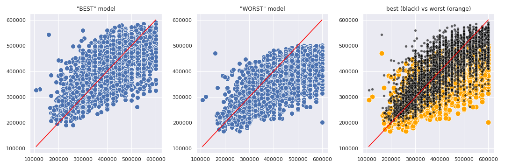
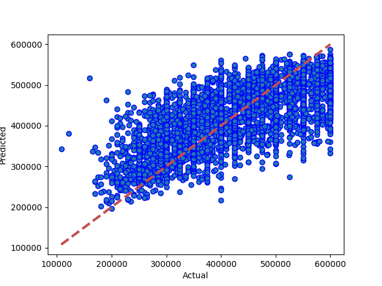
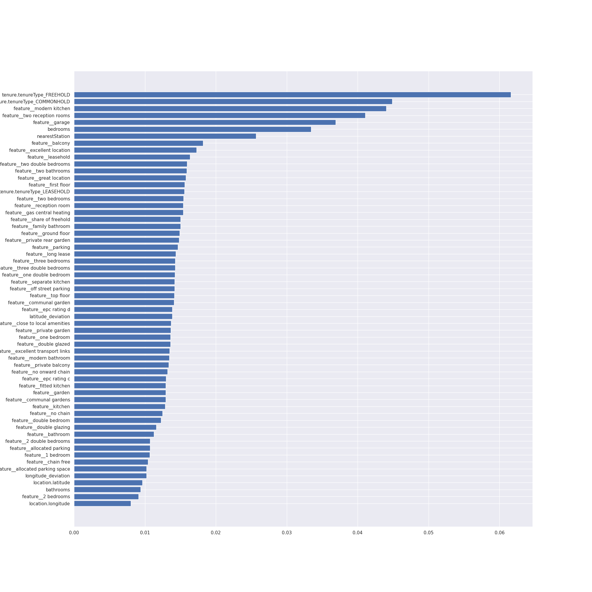
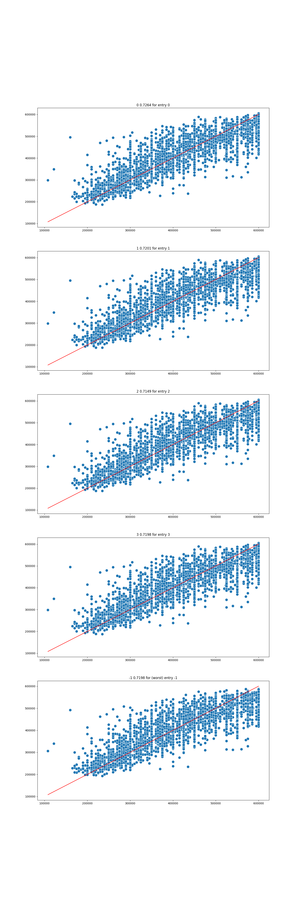

# Results from XG Boost (tree)
### Dataset Version: 10
Date run: 2023-01-03 13:26:54.973879

Start time: 2023-01-03 12:15:28.487132

End time: 2023-01-03 13:26:54.973866

## Results
### Summary
not updated saved model, the previous run was better
0.5895112747814537 is worse than or equal to 0.7263637388413389

### Tuned Models ranked by performance, with parameter details
|   rank_test_score |   mean_test_score |   mean_fit_time |   mean_score_time |   param_model__verbosity | param_model__tree_method   |   param_model__subsample | param_model__objective   |   param_model__n_jobs |   param_model__n_estimators |   param_model__min_samples_leaf |   param_model__min_sample_split |   param_model__max_samples |   param_model__max_leaf_nodes |   param_model__max_features |   param_model__max_depth |   param_model__learning_rate |   param_model__lambda |   param_model__colsample_bytree | param_model__booster   | params2                                                                         |
|------------------:|------------------:|----------------:|------------------:|-------------------------:|:---------------------------|-------------------------:|:-------------------------|----------------------:|----------------------------:|--------------------------------:|--------------------------------:|---------------------------:|------------------------------:|----------------------------:|-------------------------:|-----------------------------:|----------------------:|--------------------------------:|:-----------------------|:--------------------------------------------------------------------------------|
|                 1 |          0.581297 |        20.0929  |         0.568847  |                        2 | hist                       |                     0.5  | reg:squarederror         |                     3 |                          50 |                                 |                               2 |                       0.9  |                             2 |                          64 |                       10 |                          0.1 |                    50 |                            0.9  | dart                   | 2/hist/0.5/reg:squarederror/3/50/None/2/0.9/2/64/10/0.1/50/0.9/dart             |
|                 2 |          0.571999 |        85.1665  |         0.247938  |                        2 | auto                       |                     1    | reg:squarederror         |                     3 |                          50 |                              20 |                                 |                       0.5  |                               |                          64 |                       20 |                              |                    50 |                            1    | gbtree                 | 2/auto/1/reg:squarederror/3/50/20/None/0.5/None/64/20/None/50/1/gbtree          |
|                 3 |          0.57175  |        82.7126  |         0.694899  |                        2 | auto                       |                     1    | reg:squarederror         |                     3 |                          50 |                              20 |                             200 |                       0.9  |                           200 |                          32 |                       20 |                              |                    50 |                            0.9  | dart                   | 2/auto/1/reg:squarederror/3/50/20/200/0.9/200/32/20/None/50/0.9/dart            |
|                 4 |          0.564176 |       117.253   |         1.15456   |                        2 | auto                       |                     0.5  | reg:squarederror         |                     3 |                         100 |                                 |                               2 |                       1    |                           200 |                           8 |                       25 |                          0.1 |                     1 |                            0.5  | dart                   | 2/auto/0.5/reg:squarederror/3/100/None/2/1/200/8/25/0.1/1/0.5/dart              |
|                 5 |          0.558571 |         8.44362 |         0.0500033 |                        2 | hist                       |                     0.75 | reg:squarederror         |                     3 |                          25 |                               2 |                                 |                       1    |                             2 |                          16 |                       10 |                              |                     1 |                            0.95 | gbtree                 | 2/hist/0.75/reg:squarederror/3/25/2/None/1/2/16/10/None/1/0.95/gbtree           |
|                 6 |          0.544475 |       104.906   |         0.856438  |                        2 | auto                       |                     1    | reg:squarederror         |                     3 |                          50 |                             200 |                            2000 |                       0.75 |                           200 |                          16 |                       25 |                          0.3 |                    10 |                            0.95 | dart                   | 2/auto/1/reg:squarederror/3/50/200/2000/0.75/200/16/25/0.3/10/0.95/dart         |
|                 7 |          0.510191 |       139.103   |         0.457587  |                        2 | hist                       |                     0.75 | reg:squarederror         |                     3 |                         100 |                             200 |                             200 |                            |                               |                           2 |                       20 |                              |                       |                            0.95 | gbtree                 | 2/hist/0.75/reg:squarederror/3/100/200/200/None/None/2/20/None/None/0.95/gbtree |
### Best and worst models obtained by tuning

### Best Model: Comparing model predictions to actual property values

## Feature Importances
### Feature Importances
1. features 0 (0.132356)		bedrooms
2. features 58 (0.080792)		tenure.tenureType_FREEHOLD
3. features 57 (0.047402)		tenure.tenureType_COMMONHOLD
4. features 28 (0.043932)		feature__garage
5. features 56 (0.043565)		feature__two reception rooms
6. features 55 (0.041632)		feature__two double bedrooms
7. features 2 (0.029081)		nearestStation
8. features 54 (0.015965)		feature__two bedrooms
9. features 5 (0.015595)		latitude_deviation
10. features 40 (0.015480)		feature__off street parking
11. features 16 (0.015150)		feature__communal garden
12. features 30 (0.015092)		feature__gas central heating
13. features 23 (0.014283)		feature__excellent location
14. features 26 (0.014111)		feature__first floor
15. features 24 (0.014018)		feature__excellent transport links
16. features 37 (0.013196)		feature__modern kitchen
17. features 49 (0.013149)		feature__share of freehold
18. features 34 (0.013084)		feature__leasehold
19. features 47 (0.012996)		feature__reception room
20. features 15 (0.012750)		feature__close to local amenities
21. features 48 (0.012673)		feature__separate kitchen
22. features 35 (0.012555)		feature__long lease
23. features 9 (0.012282)		feature__2 double bedrooms
24. features 21 (0.011916)		feature__epc rating c
25. features 25 (0.011877)		feature__family bathroom
26. features 50 (0.011815)		feature__three bedrooms
27. features 59 (0.011774)		tenure.tenureType_LEASEHOLD
28. features 12 (0.011672)		feature__balcony
29. features 6 (0.011665)		longitude_deviation
30. features 32 (0.011640)		feature__ground floor
31. features 27 (0.011626)		feature__fitted kitchen
32. features 22 (0.010786)		feature__epc rating d
33. features 45 (0.010768)		feature__private garden
34. features 43 (0.010713)		feature__parking
35. features 51 (0.010592)		feature__three double bedrooms
36. features 31 (0.010564)		feature__great location
37. features 17 (0.010547)		feature__communal gardens
38. features 38 (0.010258)		feature__no chain
39. features 19 (0.010087)		feature__double glazed
40. features 44 (0.009987)		feature__private balcony
41. features 39 (0.009947)		feature__no onward chain
42. features 46 (0.009904)		feature__private rear garden
43. features 29 (0.009757)		feature__garden
44. features 36 (0.009647)		feature__modern bathroom
45. features 52 (0.009514)		feature__top floor
46. features 53 (0.009509)		feature__two bathrooms
47. features 41 (0.009304)		feature__one bedroom
48. features 42 (0.009176)		feature__one double bedroom
49. features 14 (0.009021)		feature__chain free
50. features 18 (0.008806)		feature__double bedroom
51. features 7 (0.008471)		feature__1 bedroom
52. features 13 (0.008332)		feature__bathroom
53. features 33 (0.008194)		feature__kitchen
54. features 4 (0.007951)		location.longitude
55. features 20 (0.007884)		feature__double glazing
56. features 8 (0.007750)		feature__2 bedrooms
57. features 3 (0.007395)		location.latitude
58. features 11 (0.007038)		feature__allocated parking space
59. features 10 (0.006504)		feature__allocated parking
60. features 1 (0.006470)		bathrooms

### Feature Importances (XG Boost (tree))

## Comparison with other models
### Comparison with version 10 performances
|                                         |   best score |    best time |   Mean Absolute Error Accuracy |   Mean Squared Error Accuracy |   R square Accuracy |   Root Mean Squared Error | best run date              | best method                                                        |
|:----------------------------------------|-------------:|-------------:|-------------------------------:|------------------------------:|--------------------:|--------------------------:|:---------------------------|:-------------------------------------------------------------------|
| xg boost (tree) (v10)                   |     0.726364 |   69.306     |                        53862.9 |                   4.63705e+09 |            0.589511 |                   68095.9 | 2023-01-02 17:58:16.959076 | custom                                                             |
| catboost (v10)                          |     0.694651 |    4.77      |                        68364.3 |                   7.1318e+09  |            0.368666 |                   84450   | 2022-11-30 14:14:50.145713 | random search(no dummies)                                          |
| random forest - random search (vx10)    |     0.647421 |  nan         |                        49942   |                   3.98288e+09 |            0.647421 |                   63110.1 | nan                        | nan                                                                |
| neural network m13 mega (v10)           |     0.583716 |  142.89      |                        54668.9 |                   4.94809e+09 |            0.561977 |                   70342.6 | 2022-12-01 10:27:39.663081 | loss=3878948096.0 valloss=4822886400.0 +valsplit=0.1 stop=38/400   |
| neural network m14 mega (v10)           |     0.579095 | 1129.09      |                        53124   |                   4.75471e+09 |            0.579095 |                   68954.4 | 2022-12-01 11:52:45.011704 | loss=4.85e+04 valloss=5.34e+04 +valsplit=0.1 stop=156/400          |
| neural network m15 mega + dropout (v10) |     0.574437 | 2488.18      |                        53257.8 |                   4.80733e+09 |            0.574437 |                   69334.9 | 2023-01-03 13:24:06.467094 | loss=4.69e+04 valloss=5.37e+04 +valsplit=0.1 +patn=25 stop=170/400 |
| neural network m12 mega (v10)           |     0.567453 |  240.1       |                        55444   |                   4.88623e+06 |            0.567453 |                   69901.6 | 2022-12-01 09:57:17.586487 | loss=4790.75 valloss=4998.79 +valsplit=0.1 stop=66/400             |
| decision tree - random search (vx10)    |     0.558257 |  nan         |                        55865.4 |                   4.99011e+09 |            0.558257 |                   70640.7 | nan                        | nan                                                                |
| knn - random search (vx10)              |     0.533823 |    0.0497677 |                        57566.9 |                   5.26613e+09 |            0.533823 |                   72568.1 | nan                        | nan                                                                |
| knn (v10)                               |     0.484585 |    0.29179   |                        61764.2 |                   5.82234e+09 |            0.484585 |                   76304.2 | 2022-11-30 15:12:50.989371 | random search                                                      |
| linear regression (ridge) (v10)         |     0.470806 |    0.239057  |                        62597.9 |                   5.97812e+09 |            0.470795 |                   77318.3 | 2022-12-01 19:50:08.050622 | random search                                                      |
| neural network m02 two layers (v10)     |     0.452732 |  198.06      |                        63576.2 |                   6.18216e+09 |            0.452732 |                   78626.7 | 2023-01-03 12:29:49.352260 | loss=6.32e+09 valloss=6.36e+09 +valsplit=0.1 +patn=25              |
### Comparison with all model performances
|                                                           |   best score |    best time |   Mean Absolute Error Accuracy |   Mean Squared Error Accuracy |   R square Accuracy |   Root Mean Squared Error | best run date              | best method                                                                                                            |
|:----------------------------------------------------------|-------------:|-------------:|-------------------------------:|------------------------------:|--------------------:|--------------------------:|:---------------------------|:-----------------------------------------------------------------------------------------------------------------------|
| xg boost (tree) (v11)                                     |     0.731739 |   71.0203    |                41595.3         |                   3.03039e+09 |            0.731739 |           55049           | 2023-01-02 18:02:37.951724 | custom                                                                                                                 |
| xg boost (tree) (v09)                                     |     0.728969 |   89.2137    |                55307.3         |                   4.97574e+09 |            0.559529 |           70538.9         | 2023-01-02 16:33:38.004418 | custom                                                                                                                 |
| xg boost (tree) (v06)                                     |     0.727132 |  134.175     |                42215           |                   3.09601e+09 |            0.725929 |           55641.8         | 2022-12-07 09:43:37.103009 | random search                                                                                                          |
| xg boost (tree) (v10)                                     |     0.726364 |   69.306     |                53862.9         |                   4.63705e+09 |            0.589511 |           68095.9         | 2023-01-02 17:58:16.959076 | custom                                                                                                                 |
| knn (v06)                                                 |     0.719049 |    0.0179159 |                41531.1         |                   3.2181e+09  |            0.715122 |           56728.3         | 2022-11-21 18:05:21.585382 | random search                                                                                                          |
| catboost (v06)                                            |     0.715606 |   12.2565    |                51000           |                   4.30136e+09 |            0.619227 |           65584.8         | 1999-11-13 15:26:55.706567 | random search                                                                                                          |
| light gradient boosting (v06)                             |     0.706735 |   15.0439    |                44081           |                   3.31284e+09 |            0.706735 |           57557.3         | 2022-11-16 13:59:52.612654 | random search                                                                                                          |
| catboost (v09)                                            |     0.700506 |    2.82      |                74210.9         |                   8.5691e+09  |            0.241431 |           92569.4         | 2022-11-30 13:34:39.793583 | random search(no dummies)                                                                                              |
| catboost (v10)                                            |     0.694651 |    4.77      |                68364.3         |                   7.1318e+09  |            0.368666 |           84450           | 2022-11-30 14:14:50.145713 | random search(no dummies)                                                                                              |
| catboost (v11)                                            |     0.689818 |   12.81      |                70705.7         |                   7.67228e+09 |            0.320821 |           87591.5         | 2022-11-30 16:14:29.405177 | random search(no dummies)                                                                                              |
| random forest (v09)                                       |     0.680091 | 1127.32      |                46294.6         |                   3.61382e+09 |            0.680091 |           60115           | 2022-12-11 19:26:14.332459 | random search                                                                                                          |
| random forest - random search (vx10)                      |     0.647421 |  nan         |                49942           |                   3.98288e+09 |            0.647421 |           63110.1         | nan                        | nan                                                                                                                    |
| knn (v09)                                                 |     0.644916 |    0.112408  |                48389.1         |                   4.15737e+09 |            0.631974 |           64477.7         | 2022-11-30 12:53:42.390150 | random search                                                                                                          |
| knn - random search (v02)                                 |     0.62747  |  nan         |                49441.2         |                   4.26278e+09 |            0.62747  |           65290           | nan                        | nan                                                                                                                    |
| neural network m15 mega + dropout (v09)                   |     0.622235 | 2077.84      |                    2.12535e+11 |                   4.79951e+22 |          -15.9948   |               2.19078e+11 | 2022-12-13 23:57:56.104125 | loss=4.38e+04 valloss=4.85e+04 +valsplit=0.1 +patn=25 stop=306/400                                                     |
| decision tree (v09)                                       |     0.619635 |    0.409451  |                51319.1         |                   4.31524e+09 |            0.617999 |           65690.5         | 2022-12-11 14:59:07.675693 | random search                                                                                                          |
| decision tree (v06)                                       |     0.616727 |    0.133738  |                59431.1         |                   5.74359e+09 |            0.491556 |           75786.5         | 2022-12-11 13:59:57.993851 | random search                                                                                                          |
| neural network m11 mega (v06)                             |     0.612318 | 2569.45      |                56035.9         |                   4.92994e+09 |            0.563583 |           70213.6         | 2022-11-29 12:57:16.459719 | loss=2833.6 valloss=4034.41 stop=619/1000                                                                              |
| neural network m14 mega (v09)                             |     0.610895 | 2179.86      |                51080.5         |                   4.39548e+09 |            0.610895 |           66298.4         | 2022-12-12 16:01:42.195065 | loss=4.68e+04 valloss=5.01e+04 +valsplit=0.1 +patn=25 stop=230/400                                                     |
| neural network m13 mega (v09)                             |     0.607154 |  500.16      |                50938.6         |                   4.43775e+09 |            0.607154 |           66616.4         | 2022-12-12 15:25:17.070719 | loss=4.55e+04 valloss=5.03e+04 +valsplit=0.1 +patn=25 stop=104/400                                                     |
| neural network m12 mega (v06)                             |     0.594032 |  813.27      |                54968           |                   4.80703e+09 |            0.574463 |           69332.8         | 2022-11-29 17:08:44.480482 | loss=4386.51 valloss=4438.8 +valsplit=0.1 stop=201/400                                                                 |
| knn - random search (v01)                                 |     0.587939 |  nan         |                52593.9         |                   4.86155e+09 |            0.587939 |           69724.8         | nan                        | nan                                                                                                                    |
| knn - scaled (v01)                                        |     0.58744  |  nan         |                52147.4         |                   4.86744e+09 |            0.58744  |           69767.1         | nan                        | nan                                                                                                                    |
| neural network m11 mega (v09)                             |     0.587136 |  994.87      |                53873           |                   4.66388e+09 |            0.587136 |           68292.6         | 2022-12-12 15:02:24.649254 | loss=4.26e+09 valloss=4.72e+09 +valsplit=0.1 +patn=25 stop=189/400                                                     |
| random forest (v06)                                       |     0.585876 |    1.76986   |                60537           |                   5.63491e+09 |            0.501177 |           75066           | 2022-12-11 12:04:23.528125 | random search                                                                                                          |
| knn - basic (v02)                                         |     0.584356 |  nan         |                52181.5         |                   4.75613e+09 |            0.584356 |           68964.7         | nan                        | nan                                                                                                                    |
| neural network m13 mega (v10)                             |     0.583716 |  142.89      |                54668.9         |                   4.94809e+09 |            0.561977 |           70342.6         | 2022-12-01 10:27:39.663081 | loss=3878948096.0 valloss=4822886400.0 +valsplit=0.1 stop=38/400                                                       |
| neural network m05 rec deep (v06)                         |     0.580348 |  604.9       |                59357.5         |                   5.47083e+09 |            0.515701 |           73965.1         | 2022-11-29 11:41:39.682217 | loss=4908.71 valloss=4603.08 stop=214/500                                                                              |
| neural network m14 mega (v10)                             |     0.579095 | 1129.09      |                53124           |                   4.75471e+09 |            0.579095 |           68954.4         | 2022-12-01 11:52:45.011704 | loss=4.85e+04 valloss=5.34e+04 +valsplit=0.1 stop=156/400                                                              |
| neural network m15 mega + dropout (v10)                   |     0.574437 | 2488.18      |                53257.8         |                   4.80733e+09 |            0.574437 |           69334.9         | 2023-01-03 13:24:06.467094 | loss=4.69e+04 valloss=5.37e+04 +valsplit=0.1 +patn=25 stop=170/400                                                     |
| neural network m12 mega (v09)                             |     0.571972 |  848.7       |                54696           |                   4.83518e+09 |            0.571972 |           69535.4         | 2022-12-12 15:16:52.189760 | loss=4.76e+09 valloss=4.77e+09 +valsplit=0.1 +patn=25 stop=179/400                                                     |
| neural network m15 mega + dropout (v11)                   |     0.5707   | 1191.61      |                53709.7         |                   4.84954e+09 |            0.5707   |           69638.7         | 2022-12-21 02:55:33.483148 | loss=4.43e+04 valloss=5.35e+04 +valsplit=0.1 +patn=25 stop=170/400                                                     |
| neural network m12 mega (v10)                             |     0.567453 |  240.1       |                55444           |                   4.88623e+06 |            0.567453 |           69901.6         | 2022-12-01 09:57:17.586487 | loss=4790.75 valloss=4998.79 +valsplit=0.1 stop=66/400                                                                 |
| neural network m05 rec deep (v09)                         |     0.558413 | 1471.09      |                56357.5         |                   5.01567e+09 |            0.555995 |           70821.4         | 2022-12-12 13:21:58.501853 | loss=4.87e+09 valloss=4.84e+09 +valsplit=0.1 +patn=25                                                                  |
| decision tree - random search (vx10)                      |     0.558257 |  nan         |                55865.4         |                   4.99011e+09 |            0.558257 |           70640.7         | nan                        | nan                                                                                                                    |
| neural network (v06)                                      |     0.556696 |  312.991     |                66710.7         |                   6.64686e+09 |            0.411595 |           81528.3         | 2000-01-01 17:09:59.063570 | random search [input11, d^20-500-500-20-5, dense1]                                                                     |
| neural network m03 2 layers+wider (v06)                   |     0.549647 |  275.71      |                64376.5         |                   6.26802e+09 |            0.445131 |           79170.9         | 2022-11-29 10:13:10.517896 | mse +epochs=500 +learn=0.003 +loss=5229.0478515625                                                                     |
| knn - basic (v01)                                         |     0.546891 |  nan         |                55623.7         |                   5.34585e+09 |            0.546891 |           73115.3         | nan                        | nan                                                                                                                    |
| neural network m01 simple (v06)                           |     0.541221 |   36.2       |                69132           |                   7.15587e+09 |            0.366536 |           84592.4         | 2022-11-29 09:13:15.856770 | recommended simple model/mse +norm +epochs=50 +learn=0.003 +endloss=5610.65771484375 +stop=17 +endloss=5511.7373046875 |
| neural network m02 two layers (v09)                       |     0.540824 |  178.62      |                59659.9         |                   5.50478e+09 |            0.512696 |           74194.2         | 2022-11-30 13:34:57.703544 | loss=5424.62 valloss=5263.41 +valsplit=0.1 stop=52/500                                                                 |
| neural network m04 3 layers+wider (v09)                   |     0.540678 | 1367.3       |                60774.6         |                   5.6628e+09  |            0.498708 |           75251.6         | 2022-12-12 11:55:30.653553 | loss=5.20e+09 valloss=5.09e+09 +valsplit=0.1 +patn=25                                                                  |
| neural network simplified (v06)                           |     0.540642 |  999         |                59373.1         |                   5.53151e+09 |            0.51033  |           74374.1         | 2022-11-20 20:03:40.645221 | recommended simple model + normalise, mse                                                                              |
| knn - random search (vx10)                                |     0.533823 |    0.0497677 |                57566.9         |                   5.26613e+09 |            0.533823 |           72568.1         | nan                        | nan                                                                                                                    |
| neural network - random search [i64,norm,d64^6,d1] (v11)  |     0.533579 |  nan         |                57201.7         |                   5.26888e+09 |            0.533579 |           72587           | nan                        | nan                                                                                                                    |
| neural network m04 3 layers+wider (v06)                   |     0.520933 |  395.14      |                64421.2         |                   6.26641e+09 |            0.445274 |           79160.6         | 2022-11-29 11:21:09.812732 | loss=5415.7 valloss=5095.94 stop=166/500                                                                               |
| neural network m02 two layers (v06)                       |     0.516773 |  112.54      |                64363.1         |                   6.26209e+09 |            0.445656 |           79133.4         | 2022-11-29 09:31:18.853517 | mse +norm +epochs=50 +learn=0.003 +endloss=5785.6953125                                                                |
| neural network m01 simple (v09)                           |     0.508847 |  188.63      |                71376.9         |                   7.55056e+09 |            0.331597 |           86893.9         | 2022-11-30 13:08:10.248178 | loss=5724.92 valloss=5608.12 +valsplit=0.1 stop=42/50                                                                  |
| neural network with autoencoding m15 mega + dropout (v11) |     0.488747 | 1276.23      |                58773.7         |                   5.77532e+09 |            0.488747 |           75995.5         | 2022-12-22 19:06:48.049482 | loss=5.27e+04 valloss=5.91e+04 +valsplit=0.1 +patn=25 stop=181/400                                                     |
| knn (v10)                                                 |     0.484585 |    0.29179   |                61764.2         |                   5.82234e+09 |            0.484585 |           76304.2         | 2022-11-30 15:12:50.989371 | random search                                                                                                          |
| linear regression (ridge) (v11)                           |     0.484311 |    0.2412    |                61567.5         |                   5.82554e+09 |            0.484302 |           76325.2         | 2023-01-01 10:07:22.564855 | random search(pca,1.0% retain)                                                                                         |
| linear regression (ridge) (v10)                           |     0.470806 |    0.239057  |                62597.9         |                   5.97812e+09 |            0.470795 |           77318.3         | 2022-12-01 19:50:08.050622 | random search                                                                                                          |
| knn (v11)                                                 |     0.465113 |    0.618877  |                62944.7         |                   6.0423e+09  |            0.465113 |           77732.2         | 2022-11-30 16:20:53.948815 | random search                                                                                                          |
| linear regression (ridge) (v09)                           |     0.459973 |    0.132456  |                63343           |                   6.10037e+09 |            0.459973 |           78104.9         | 2023-01-02 00:17:19.098111 | rerun best: random search(-)                                                                                           |
| linear regression (ridge) (v06)                           |     0.4569   |    0.28695   |                63603.1         |                   6.13521e+09 |            0.456889 |           78327.6         | 2022-12-03 19:20:52.874336 | random search                                                                                                          |
| neural network m02 two layers (v10)                       |     0.452732 |  198.06      |                63576.2         |                   6.18216e+09 |            0.452732 |           78626.7         | 2023-01-03 12:29:49.352260 | loss=6.32e+09 valloss=6.36e+09 +valsplit=0.1 +patn=25                                                                  |
| neural network m03 2 layers+wider (v09)                   |     0.4523   | 1822.49      |                64123.6         |                   6.24293e+09 |            0.447352 |           79012.2         | 2022-12-11 18:56:27.304803 | loss=6.38e+09 valloss=6.41e+09 +valsplit=0.1 +patn=25                                                                  |
| linear regression (ridge) - random search (v05)           |     0.443478 |  nan         |                63770.7         |                   6.19128e+09 |            0.443478 |           78684.7         | nan                        | nan                                                                                                                    |
| neural network with autoencoding m15 mega + dropout (v09) |     0.42689  | 1641.39      |                64379.5         |                   6.47409e+09 |            0.42689  |           80461.7         | 2022-12-21 01:26:33.005210 | loss=6.51e+04 valloss=6.52e+04 +valsplit=0.1 +patn=25 stop=214/400                                                     |
| linear regression (ridge) - random search (v02)           |     0.326879 |  nan         |                71267.9         |                   7.70239e+09 |            0.326879 |           87763.2         | nan                        | nan                                                                                                                    |
| linear regression (ridge) - random search (v03)           |     0.326511 |  nan         |                70746.7         |                   7.49253e+09 |            0.326511 |           86559.4         | nan                        | nan                                                                                                                    |
| linear regression (ridge) - random search (v04)           |     0.321224 |  nan         |                71834.4         |                   7.71252e+09 |            0.321224 |           87821           | nan                        | nan                                                                                                                    |
| linear regression - basic (v01)                           |     0.29667  |  nan         |                72921.6         |                   8.29799e+09 |            0.29667  |           91093.3         | nan                        | nan                                                                                                                    |
## Appendix
### Data Sample
|          |   Price |   bedrooms |   bathrooms |   nearestStation |   location.latitude |   location.longitude |   latitude_deviation |   longitude_deviation | tenure.tenureType   |   feature__1 bedroom |   feature__2 bedrooms |   feature__2 double bedrooms |   feature__allocated parking |   feature__allocated parking space |   feature__balcony |   feature__bathroom |   feature__chain free |   feature__close to local amenities |   feature__communal garden |   feature__communal gardens |   feature__double bedroom |   feature__double glazed |   feature__double glazing |   feature__epc rating c |   feature__epc rating d |   feature__excellent location |   feature__excellent transport links |   feature__family bathroom |   feature__first floor |   feature__fitted kitchen |   feature__garage |   feature__garden |   feature__gas central heating |   feature__great location |   feature__ground floor |   feature__kitchen |   feature__leasehold |   feature__long lease |   feature__modern bathroom |   feature__modern kitchen |   feature__no chain |   feature__no onward chain |   feature__off street parking |   feature__one bedroom |   feature__one double bedroom |   feature__parking |   feature__private balcony |   feature__private garden |   feature__private rear garden |   feature__reception room |   feature__separate kitchen |   feature__share of freehold |   feature__three bedrooms |   feature__three double bedrooms |   feature__top floor |   feature__two bathrooms |   feature__two bedrooms |   feature__two double bedrooms |   feature__two reception rooms |
|---------:|--------:|-----------:|------------:|-----------------:|--------------------:|---------------------:|---------------------:|----------------------:|:--------------------|---------------------:|----------------------:|-----------------------------:|-----------------------------:|-----------------------------------:|-------------------:|--------------------:|----------------------:|------------------------------------:|---------------------------:|----------------------------:|--------------------------:|-------------------------:|--------------------------:|------------------------:|------------------------:|------------------------------:|-------------------------------------:|---------------------------:|-----------------------:|--------------------------:|------------------:|------------------:|-------------------------------:|--------------------------:|------------------------:|-------------------:|---------------------:|----------------------:|---------------------------:|--------------------------:|--------------------:|---------------------------:|------------------------------:|-----------------------:|------------------------------:|-------------------:|---------------------------:|--------------------------:|-------------------------------:|--------------------------:|----------------------------:|-----------------------------:|--------------------------:|---------------------------------:|---------------------:|-------------------------:|------------------------:|-------------------------------:|-------------------------------:|
| 14520525 |  550000 |          3 |           1 |         0.274316 |             51.5299 |            -0.20702  |             0.03023  |              0.1026   | LEASEHOLD           |                    0 |                     0 |                            0 |                            0 |                                  0 |                  0 |                   0 |                     0 |                                   0 |                          0 |                           0 |                         0 |                        0 |                         0 |                       0 |                       0 |                             0 |                                    0 |                          0 |                      0 |                         0 |                 0 |                 0 |                              0 |                         0 |                       0 |                  0 |                    1 |                     0 |                          0 |                         0 |                   0 |                          0 |                             0 |                      0 |                             0 |                  0 |                          1 |                         0 |                              0 |                         0 |                           1 |                            0 |                         0 |                                0 |                    0 |                        0 |                       0 |                              0 |                              0 |
| 27953107 |  400000 |          2 |           2 |         0.305845 |             51.5494 |            -0.4826   |             0.04967  |              0.37818  | LEASEHOLD           |                    0 |                     0 |                            0 |                            1 |                                  0 |                  1 |                   0 |                     0 |                                   0 |                          0 |                           0 |                         0 |                        0 |                         0 |                       0 |                       0 |                             0 |                                    0 |                          1 |                      0 |                         0 |                 0 |                 0 |                              0 |                         0 |                       0 |                  0 |                    0 |                     0 |                          0 |                         0 |                   0 |                          0 |                             0 |                      0 |                             0 |                  0 |                          0 |                         0 |                              0 |                         0 |                           0 |                            0 |                         0 |                                0 |                    1 |                        0 |                       0 |                              1 |                              0 |
| 33593487 |  579950 |          2 |           1 |         0.438045 |             51.4472 |            -0.33877  |             0.05254  |              0.23435  | FREEHOLD            |                    0 |                     0 |                            1 |                            0 |                                  0 |                  0 |                   0 |                     0 |                                   0 |                          0 |                           0 |                         0 |                        0 |                         0 |                       0 |                       0 |                             0 |                                    0 |                          0 |                      0 |                         0 |                 0 |                 0 |                              0 |                         0 |                       0 |                  0 |                    0 |                     0 |                          0 |                         0 |                   0 |                          1 |                             0 |                      0 |                             0 |                  0 |                          0 |                         0 |                              0 |                         0 |                           0 |                            0 |                         0 |                                0 |                    0 |                        0 |                       0 |                              0 |                              0 |
| 35271294 |  370000 |          2 |           1 |         0.399307 |             51.4496 |            -0.140154 |             0.050152 |              0.035734 | LEASEHOLD           |                    0 |                     0 |                            0 |                            0 |                                  0 |                  1 |                   0 |                     0 |                                   0 |                          0 |                           0 |                         0 |                        0 |                         1 |                       0 |                       0 |                             0 |                                    0 |                          0 |                      0 |                         0 |                 0 |                 0 |                              0 |                         1 |                       0 |                  0 |                    0 |                     0 |                          0 |                         0 |                   0 |                          0 |                             0 |                      0 |                             0 |                  0 |                          0 |                         0 |                              0 |                         0 |                           0 |                            0 |                         0 |                                0 |                    0 |                        0 |                       0 |                              0 |                              0 |
| 44749111 |  475000 |          2 |           1 |         0.41055  |             51.37   |            -0.21241  |             0.12967  |              0.10799  | FREEHOLD            |                    0 |                     0 |                            0 |                            0 |                                  0 |                  0 |                   0 |                     0 |                                   0 |                          0 |                           0 |                         0 |                        0 |                         0 |                       0 |                       0 |                             0 |                                    0 |                          0 |                      0 |                         1 |                 0 |                 0 |                              0 |                         0 |                       0 |                  0 |                    0 |                     0 |                          0 |                         0 |                   0 |                          0 |                             0 |                      0 |                             0 |                  0 |                          0 |                         0 |                              0 |                         0 |                           0 |                            0 |                         0 |                                0 |                    0 |                        0 |                       0 |                              0 |                              0 |
### Hyperparameter options for Randomized Grid Search
model__booster = ['gbtree', 'dart']

model__n_estimators = [25, 50, 75, 100, 150, 200]

model__learning_rate = [None, 0.3, 0.1, 0.01]

model__lambda = [None, 1, 10, 50]

model__tree_method = ['auto', 'hist']

model__max_depth = [10, 15, 20, 25]

model__subsample = [1, 0.5, 0.75, 0.9]

model__colsample_bytree = [1, 0.5, 0.75, 0.9, 0.95]

model__min_sample_split = [None, 2, 20, 200, 2000]

model__max_leaf_nodes = [None, 2, 20, 200, 2000]

model__min_samples_leaf = [None, 2, 20, 200, 2000, 5000]

model__max_samples = [None, 1, 0.5, 0.75, 0.9]

model__max_features = [None, 2, 4, 8, 16, 32, 64]

model__objective = ['reg:squarederror', 'reg:squaredlogerror']

model__n_jobs = [3]

model__verbosity = [2]

### Range of hyperparameter results

### Environment Variables
notebook_environment = gradient

use_gpu = True

debug_mode = False

quick_mode = False

quick_override_cv_splits = 2

quick_override_n_iter = 10

quick_override_n_jobs = 3

